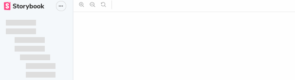
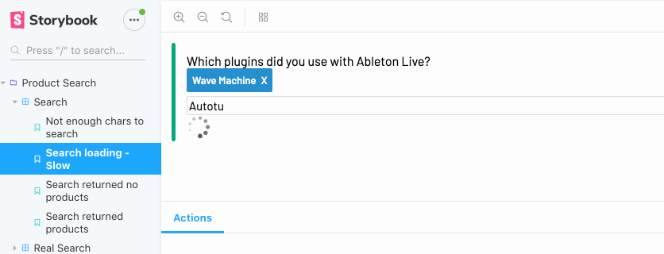

[](https://badge.fury.io/js/storybook-animate)

# Storybook-Animate

Storybook is great for designing indivdual states of your application's components.
But your users don't see your app as individual states, but a series of states that flow together over time. If storybook lets you design the frames, Storybook-Animate lets you create the flipbook!

## Simplicity Breeds Creativity

Where you used to provide a story of a single component with props:

```js
storiesOf('Thermometer', module)
  .add('Healthy Temperature', () => (
    <Thermometer scale="F" temp={98.6}> 
  ))
```

You can animate the component with a `propStream`

```js
storiesOf('Thermometer', module)
  .add('Healthy Temperature', () => (
    <Animate
      component={Thermometer}
      propStream={climbingTemp}
    />    
  ))
```

And here is the beautiful result:



Try clicking on the animation to restart it, or using `<Animate loop={true} ... />` to just sit back and admire your animation :)

## Dive into Streams
A `propStream` is an [RxJS](https://github.com/ReactiveX/rxjs) Observable, created any way you like. But to ease you in,  Storybook-Animate includes some helpers to supplement those provided by Rx-Helper:

```js
const climbingTemp = sequenceOf(
  after(0.0, { temp: 86 }),
  after(1000, { temp: 92 }),
  after(1000, { temp: 96 }),
  after(1000, { temp: 99 }),
  after(1000, { temp: 100.5 }),
  after(1000, { temp: 102.2 })
).combineWith({scale: "F"})
```

## Storybook Your API calls, Loading States, API Errors

Sometimes your users see loading states for a lot longer than you are able to during development—why not have stories for those loading states too? Feel their pain, and design to improve upon it right there in your UX design tool. 

Like this example from a recent Storybook:



<details>

<summary>
Here's how:
</summary>

Imagine an oversimplified auto-complete component such as this one.

```js
import { searchApi } from './anotherFile'

function AutoComplete() {
  const [results, setResults] = useState([])
  return (
    <input onChange={(e) => {
      searchApi(e.target.text)
        .then(results => setResults(results))
    }/>
    { /* render results */ }
  )
}
```

It calls `searchApi`, a Promise-returning function, to get results, which are objects like `{text: 'Boom', value: 25}`. It then changes internal state with those results to cause a re-render. To simulate a slow state, the first thing we must do is make the component _default_ to using the search function it used before, but make it overridable as a prop.

```js
import {searchApi} from './anotherFile'
function AutoComplete({ searchFunction = searchApi }) {
  ...
}
```

Now it will call searchApi by default _unless_ another function is provided. Let's provide one. Here's a mock function that, after a delay of 3000 msec, returns the array we'd get from the real service.

```js
const slowSearch = term => after(3000, [
  {text: 'Abacus', value: 1},
  {text: 'AbbA', value: 2}
])).toPromise()
```

And now let's hand this function in to AutoComplete in our storeis.
Now AutoComplete can display the results we want, when we want them! 

```js
storiesOf('Autocomplete', module)
  .add('Regular Loading', () => (
    <AutoComplete/>
  ))
  .add('Slow Loading', () => (
    <AutoComplete searchFunction={slowSearch} />
  ))
```

Why not add mock functions for failed lookups as well? This will make you think, and plan for it. All without leaving Storybook, thanks to Storybook-Animate, and RxJS Observables.

</details>

## The Sky's The Limit!

You can combine Storybook-Animate with other means of animations. CSS animations, React Transition Groups internal to your components - you are only limited by what you can come up with!

Got ideas that we haven't thought of? Search for an issue or open one if you don't see it.

## Examples

The Thermometer example is in the `stories/` folder of this project. Feel free to post a link to what you've built with it too, we can include it here!

